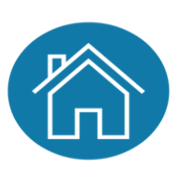
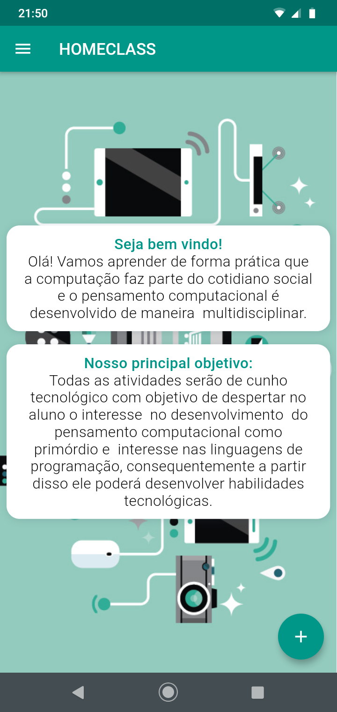

# HomeClass

__Resumo do aplicativo__

Um aplicativo de atividades práticas multidisciplinares que impulsionam o desenvolvimento do pensamento computacional e que possam ser realizadas pelos alunos com facilidade de maneira remota, ou seja, o  professor terá em suas mãos um recurso que dispõe de um material que ele pode desenvolver com os alunos no ensino a distância.  Esse momento atual vivenciado por todos trouxe desafios no conceito do ambiente de ensino, principalmente para alunos de ensino fundamental e infantil como exemplo. 
Todas as atividades são de cunho tecnológico com objetivo de despertar no aluno o interesse  no desenvolvimento  do pensamento computacional como primórdio, e  interesse nas linguagens de programação, consequentemente a partir disso ele poderá desenvolver habilidades tecnológicas. Para isso, não necessariamente as atividades propostas fazem o uso de recursos tecnológicos pois, outro aspecto foi que levamos em consideração  os recursos disponíveis nas casa dos alunos além de estimularmos o aprendizado  para o entendimento sobre o que realmente é tecnologia, e que eles possam desenvolver atividades tecnológicas tmabém pelo método desplugado.

 
__Competências Educacionais__:

- [x] Pilares da Programação
- [x] Multidisciplinaridade
- [x] Desenvolvimento Cognitvo

__Logo__ 
 

__Tela Inicial Externa: Login__

O usuário faz o login, ou o cadastro caso seja novo usuário.

__Tela de Formulário: Formulário de Cadastro do Usuário__

O usuário faz o seu cadastro com informações básicas. 

__Tela Interna: Home-Informações sobre as Atividades:__

Essa tela possui o botão de cadastramento das atividades, e segue para tela seguinte.

__Tela Interna: Formulário de Cadastro de Novas Atividade__

O usuário poderá cadastrar as novas atividades e inserir outras disciplinas. 

__Tela de Pesquisa: Navegação de Telas:__

O usuário pode entrar nas disciplinas, ou home ou sair do aplicativo.

__Tela Interna: Principal das Diciplinas e atividades__

O usuário acessa todas as disciplinas com suas respectivas atividades. 

__Tela Interna: Atividades__

A atividade cadastrada nas disciplinas, todas com abordagens para o desenvolvimento do Pensamento Computacional. 

